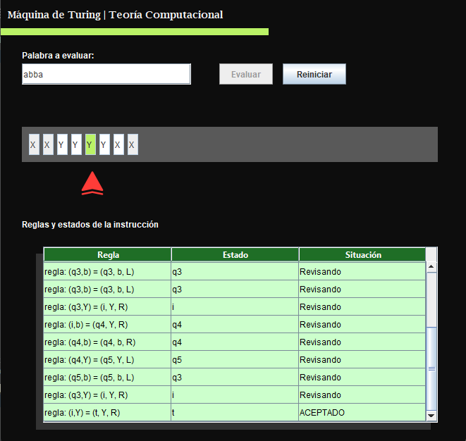

<h1 align="center">Maquina de Turing</h1>

Este proyecto es el resultado final de la materia de Teoría Computacional, en él se emula el funcionamiento de una máquina de Turing con el lenguaje Java.

<h1 align="center">Tecnologías Utilizadas</h1>

  

<h1 align="center">Detalles del Proyecto</h1>

Proyecto de la materia de Teoría Computacional que emula el funcionamiento de una máquina de Turing en java. Aceptando el lenguaje ww^R (Palabra+Palabra Inversa), por medio de arreglos y de las reglas estipuladas se verifica si una palabra ingresada por el usuario cumple con las condiciones para ser aceptada. La gramática es de a|b por lo que si se ingresa un carácter diferente se rechaza inmediatamente. Cuenta con una interfaz en la que por medio de una flecha y una serie de cambios de colores se puede ver el comportamiento del sistema. 

<h1 align="center">Características Destacadas</h1>
<ul>
  <li><b>Lenguaje específico:</b> Acepta solo palabras que pertenezcan a ww^R.</li>
  <li><b>Interfaz gráfica:</b> Muestra de manera dinámica el avance, el comportamiento y la decisión de cada letra.</li>
  <li><b>Reglas:</b> El sistema muestra las reglas que van eligiéndose a lo largo del recorrido.</li>
</ul>

<h1 align="center">Interfaz</h1>

  

